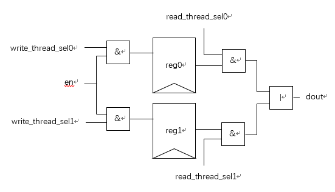

# 粗粒度两线程处理器设计方案

本处理器基于蜂鸟e203的处理器核实现。

## 资源分配方案

* 每个线程需要单独分配的寄存器：PC、register file、CSR、OITF
* 存储部件划分：平均分配
	- ITCM：0x8000_0000~0x8000_7FFF、0x8000_8000~0x8000_FFFF
	- DTCM：0x9000_0000~0x9000_7FFF、0x9000_8000~0x9000_FFFF

## 线程区分机制

增加线程标识thread_sel[0]和thread_sel[1]，哪个值为1则属于哪个线程。

## 上下文切换机制

时间片轮转（可换成其他切换策略，并进行对比，如执行长指令时切换）

切换线程时遇到分支指令，延迟切换，因为分支指令可能引起flush。

切换线程需要强制重新取指，尤其是以下情况：
* 当取指地址不对齐时，需要两个周期取指，如果刚好在第一个周期切换线程，则需要修改取指状态，放弃当前的取指，否则会在第二个周期将上个线程的指令传回。
* 当EXU执行长指令时，上一个线程取完指令，等待长指令执行完毕，此时切换线程按原来的设计会认为已经取指完毕不需要重新取指，所以需要强制重新取指。

## 寄存器选择方案

输入使能信号需要和各自的线程选择信号进行与运算，其余输入均相同，输出的每一位需要和各自的线程选择信号进行与运算，最后对应位进行或运算


## PC复位值修改

复位时PC的复位值为Mask ROM的地址，执行ROM里面的代码跳转到ITCM的起始地址0x8000_0000执行，这里需要修改为复位时将两个PC都初始化为对应的起始地址。

## 运行起始地址修改

修改文件e200_opensource/rtl/e203/perips/sirv_aon_wrapper.v  

```verilog
assign pc_rtvec = aon_io_bootrom ? 32'h0000_1000 : 32'h2000_0000;
```

将32'h0000_1000修改为想要运行的地址

## 程序存放位置及大小修改

修改文件e200_opensource/sirv-e-sdk/bsp/env/sirv-e203-arty/link.lds  
该文件为e200_opensource/sirv-e-sdk/bsp/env/sirv-e201-arty/link.lds的软链接  
可以用hbird-e-sdk/bsp/hbird-e200/env目录下的link_flash.lds、link_flashxip.lds和link_itcm.lds来替换  
其中
```
itcm (rxai!w) : ORIGIN = 0x80000000, LENGTH = 64K
ram (wxa!ri) : ORIGIN = 0x90000000, LENGTH = 64K
```
ORIGIN为起始地址，LENGTH为容量，可自行修改


